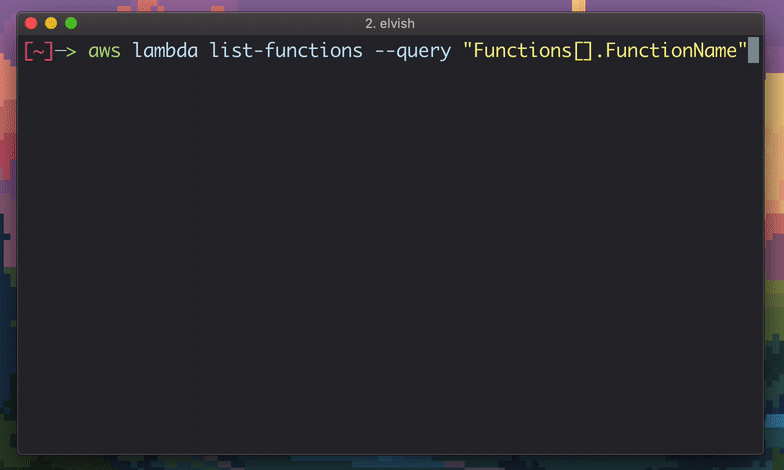

# aws-oidc

Assume roles in AWS using an OpenID Connect identity provider.

It is intended to be used as a `credentials_process` in ~/.aws/config that outputs temporary AWS credentials in a JSON format.

https://docs.aws.amazon.com/cli/latest/topic/config-vars.html#sourcing-credentials-from-external-processes

## Getting Started

For example, add the following to **~/.aws/config**:

    [profile default]
    credential_process = /Users/jeremy/projects/aws-oidc/aws-oidc auth google

And configure aws-oidc by creating **~/.aws-oidc/config** and setting the `role_arn` and `client_id`:

    region = "ap-southeast-2"

    [[AuthProvider]]
    name = "google"
    role_arn = "arn:aws:iam::012345678901:role/role-name"
    duration = 900
    provider_url = "https://accounts.google.com"
    client_id = "430784603061-osbtei3s71l0bj6d8oegto0itefjmiq6.apps.googleusercontent.com"
    agent = ["open", "-b", "com.google.chrome"]

Then you can assume the role using the AWS cli:

    aws sts get-caller-identity

Most AWS SDK implementations should be able to use the `credential_process` configuration, including:

* aws-sdk-go
* aws-cli
* boto3

## Open Chrome with a particular profile

Open `chrome://version/` in the Chrome profile you want to open as, and make a note of the last part of the profile path.

Update the `agent` option with the profile path in your **~/.aws-oidc/config** file:

    agent = ["open", "-b", "com.google.chrome", "-n", "--args", "--profile-directory=Profile 1", "{}"]

## Configure More Roles

Add the profiles for each role you want to assume to **~/.aws/config**. Specify the provider name from the configuration file, and override any default settings:

    [profile engineer]
    credential_process = aws-oidc auth onelogin --role_arn=arn:aws:iam::892845094662:role/onelogin-test-oidc --duration 7200

Make sure each authentication provider exists in **~/.aws-oidc/config**. You can also override any of the configured settings here on the command line.

To make use of this new role, simply specify the `profile` in your AWS SDK:

    aws --profile engineer sts get-caller-identity

## Run other commands with AWS credentials

Most AWS SDK's should be able to pick up the profile parameter, and support the `credentials_process` setting in your **~/.aws/config** file. If not, you can run an arbitary command with the temporary credentials with `exec`:

    aws-oidc exec engineer -- ./path/to/command with arguments

This will use the profiles defined in **~/.aws/config** to assume the role by calling `aws-oidc auth` and then set `AWS_ACCESS_KEY_ID`, `AWS_SECRET_ACCESS_KEY` and `AWS_SESSION_TOKEN` environment variables for the new process.

## Find roles that an oidc client could assume

Use the `list` command to find roles that your claim and client_id can assume:

    aws-oidc list --claim="accounts.google.com:aud" --client_id="430784603061-osbtei3s71l0bj6d8oegto0itefjmiq6.apps.googleusercontent.com"

Example using only the AWS CLI:

    aws iam list-roles --query <<EOF '
    Roles[?
      AssumeRolePolicyDocument.Statement[?
        Condition.StringEquals."accounts.google.com:aud"
      ]
    ].{
      RoleName:RoleName,
      Arn:Arn,
      ClientId:AssumeRolePolicyDocument.Statement[*].Condition.StringEquals."accounts.google.com:aud" | [0]
    } | [?
      contains(ClientId, `430784603061-osbtei3s71l0bj6d8oegto0itefjmiq6.apps.googleusercontent.com`)
    ]'
    EOF

Note, your default profile will need `iam:ListRoles` permission. To use a different profile use the `--profile` option.
